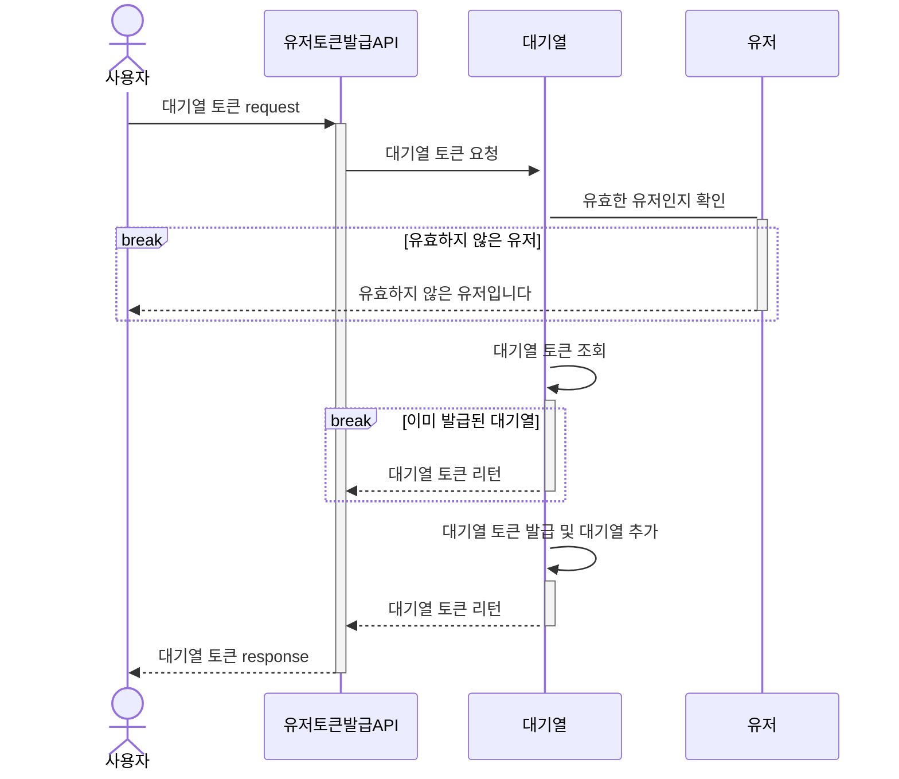
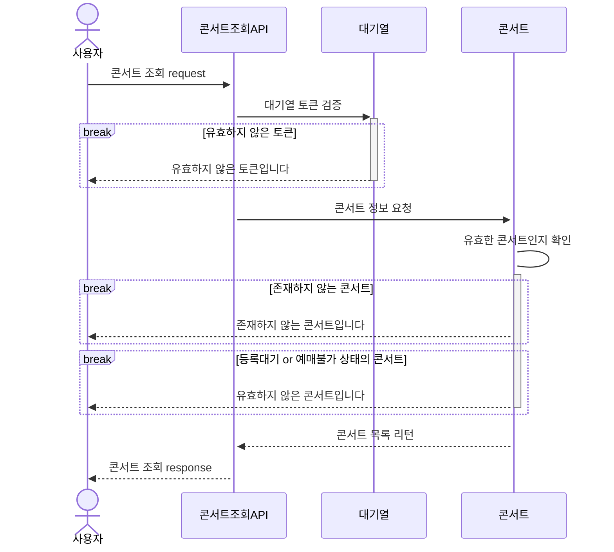
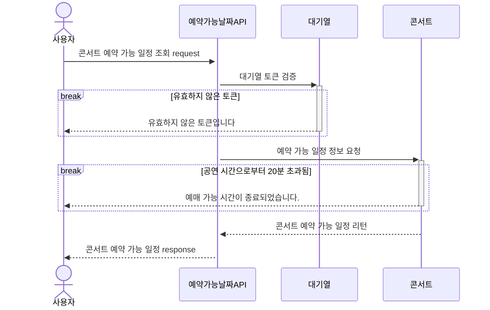
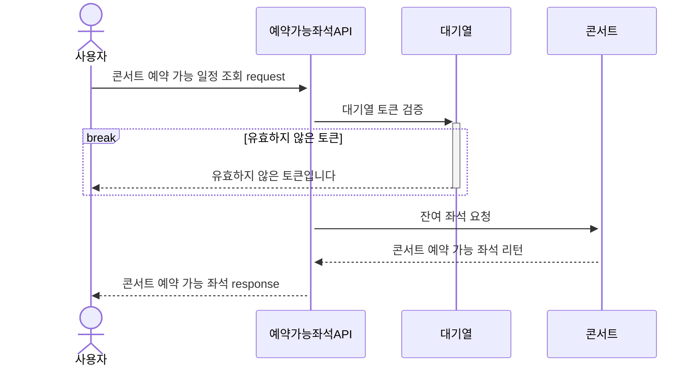
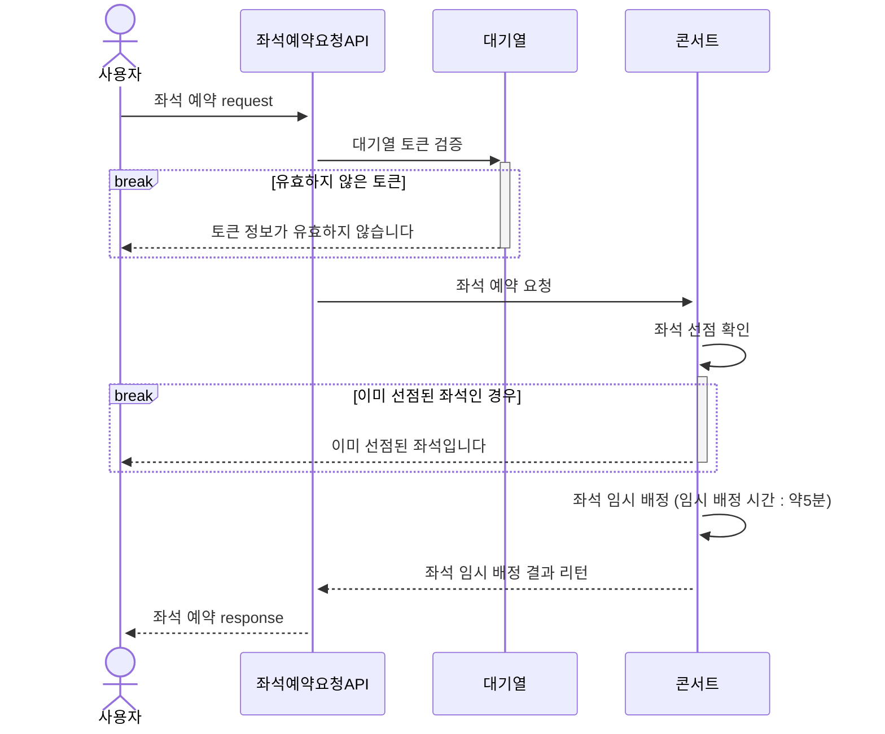
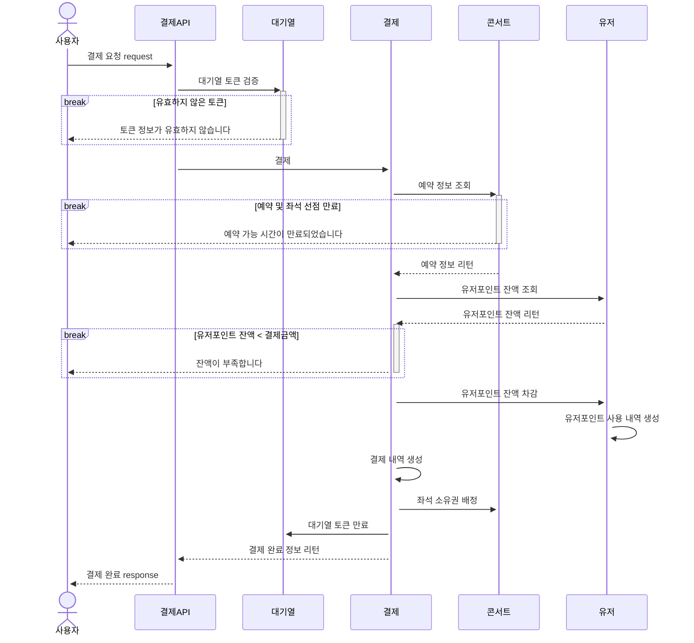
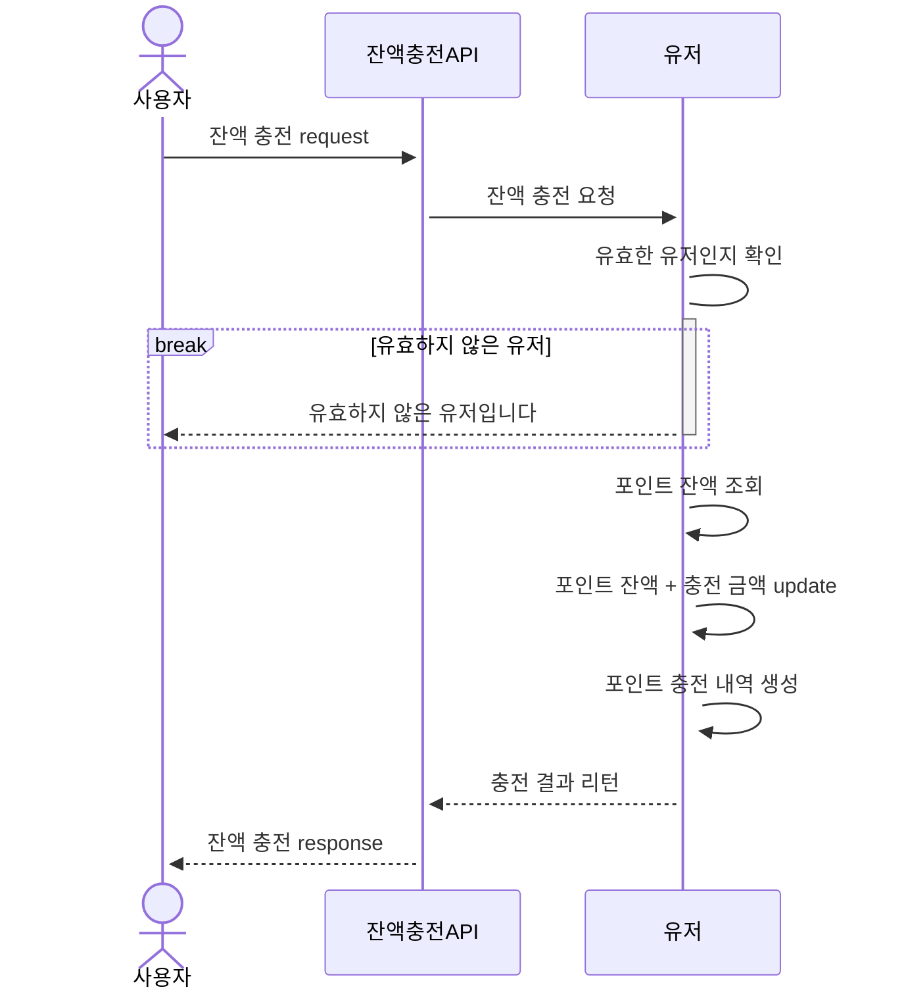
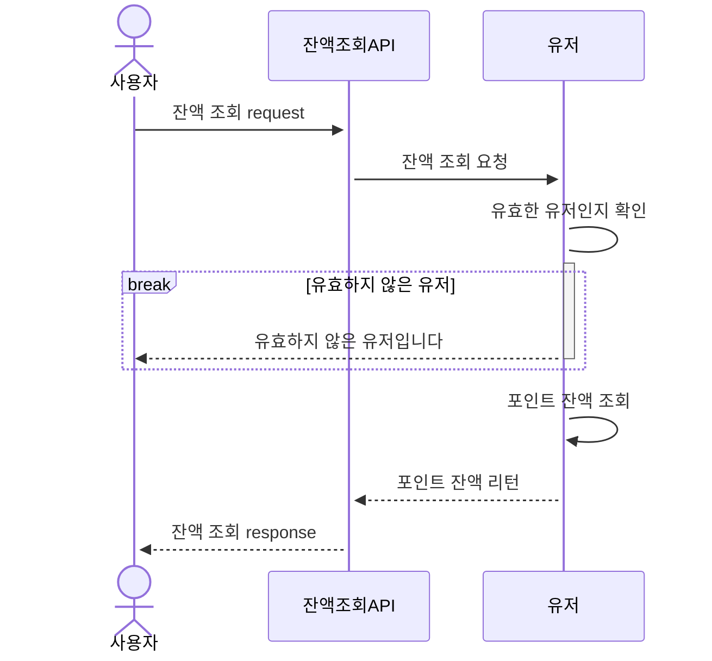

# Sequence Diagram

## 유저 토큰 발급 API

```mermaid
sequenceDiagram
actor  사용자
participant 유저토큰발급API
participant 대기열
participant 유저

사용자->>+유저토큰발급API: 대기열 토큰 request
유저토큰발급API->>+대기열: 대기열 토큰 요청
대기열->+유저: 유효한 유저인지 확인
break 유효하지 않은 유저
    유저-->>-사용자: 유효하지 않은 유저입니다
end

대기열->>+대기열: 대기열 토큰 조회
break 이미 발급된 대기열
    대기열-->>-유저토큰발급API: 대기열 토큰 리턴
end

대기열->>+대기열: 대기열 토큰 발급 및 대기열 추가
대기열-->>-유저토큰발급API: 대기열 토큰 리턴
유저토큰발급API-->>-사용자: 대기열 토큰 response
```

## 콘서트조회 API

```mermaid

sequenceDiagram
actor  사용자
participant 콘서트조회API
participant 대기열
participant 콘서트

사용자->>+콘서트조회API: 콘서트 조회 request
콘서트조회API->>+대기열: 대기열 토큰 검증
break 유효하지 않은 토큰
    대기열-->>-사용자: 유효하지 않은 토큰입니다
end

콘서트조회API->>+콘서트: 콘서트 정보 요청
콘서트->+콘서트: 유효한 콘서트인지 확인
break 존재하지 않는 콘서트
    콘서트-->>사용자: 존재하지 않는 콘서트입니다
end

break 등록대기 or 예매불가 상태의 콘서트
    콘서트-->>-사용자: 유효하지 않은 콘서트입니다
end

콘서트-->>콘서트조회API: 콘서트 목록 리턴
콘서트조회API-->>사용자: 콘서트 조회 response

```

## 예약 가능 날짜 API

```mermaid

sequenceDiagram
actor  사용자
participant 예약가능날짜API
participant 대기열
participant 콘서트

사용자->>+예약가능날짜API: 콘서트 예약 가능 일정 조회 request
예약가능날짜API->>+대기열: 대기열 토큰 검증
break 유효하지 않은 토큰
    대기열-->>-사용자: 유효하지 않은 토큰입니다
end

예약가능날짜API->>+콘서트: 예약 가능 일정 정보 요청

break 공연 시간으로부터 20분 초과됨
    콘서트-->>-사용자: 예매 가능 시간이 종료되었습니다.
end

콘서트-->>예약가능날짜API: 콘서트 예약 가능 일정 리턴
예약가능날짜API-->>사용자: 콘서트 예약 가능 일정 response

```

## 예약 가능 좌석 API

```mermaid

sequenceDiagram
actor  사용자
participant 예약가능좌석API
participant 대기열
participant 콘서트

사용자->>+예약가능좌석API: 콘서트 예약 가능 일정 조회 request
예약가능좌석API->>+대기열: 대기열 토큰 검증
break 유효하지 않은 토큰
    대기열-->>-사용자: 유효하지 않은 토큰입니다
end

예약가능좌석API->>+콘서트: 잔여 좌석 요청
콘서트-->>예약가능좌석API: 콘서트 예약 가능 좌석 리턴
예약가능좌석API-->>사용자: 콘서트 예약 가능 좌석 response

```

## 좌석 예약 요청 API

```mermaid
sequenceDiagram
    actor  사용자
    participant 좌석예약요청API
    participant 대기열
    participant 콘서트

    사용자->>+좌석예약요청API: 좌석 예약 request
    좌석예약요청API->>+대기열:대기열 토큰 검증
    break 유효하지 않은 토큰
        대기열-->>-사용자: 토큰 정보가 유효하지 않습니다
    end
    
    좌석예약요청API->>+콘서트: 좌석 예약 요청
    콘서트->>+콘서트: 좌석 선점 확인
    break 이미 선점된 좌석인 경우
        콘서트-->>-사용자: 이미 선점된 좌석입니다
    end
    콘서트->>+콘서트: 좌석 임시 배정 (임시 배정 시간 : 약5분)
    콘서트-->>+좌석예약요청API: 좌석 임시 배정 결과 리턴
    좌석예약요청API-->>+사용자: 좌석 예약 response

```

## 결제API

```mermaid
sequenceDiagram
    actor  사용자
    participant 결제API
    participant 대기열
    participant 결제
    participant 콘서트
    participant 유저

    사용자->>+결제API: 결제 요청 request
    결제API->>+대기열:대기열 토큰 검증
    break 유효하지 않은 토큰
        대기열-->>-사용자: 토큰 정보가 유효하지 않습니다
    end
    결제API->>+결제: 결제
    결제->>+콘서트: 예약 정보 조회
    break 예약 및 좌석 선점 만료
        콘서트-->>-사용자: 예약 가능 시간이 만료되었습니다
    end
    콘서트-->>+결제: 예약 정보 리턴
    결제->>+유저: 유저포인트 잔액 조회
    유저-->>+결제: 유저포인트 잔액 리턴
    break 유저포인트 잔액 < 결제금액
        결제-->>-사용자: 잔액이 부족합니다
    end
    결제->>+유저 : 유저포인트 잔액 차감
    유저->>+유저 : 유저포인트 사용 내역 생성
    결제->>+결제 : 결제 내역 생성
    결제->>+콘서트 : 좌석 소유권 배정
    결제->>+대기열 : 대기열 토큰 만료
    결제-->>+결제API: 결제 완료 정보 리턴
    결제API-->>+사용자: 결제 완료 response

```

## 잔액 충전 API

```mermaid
sequenceDiagram
    actor  사용자
    participant 잔액충전API
    participant 유저

    사용자->>+잔액충전API: 잔액 충전 request
    잔액충전API->>+유저: 잔액 충전 요청
    유저->+유저: 유효한 유저인지 확인
    break 유효하지 않은 유저
        유저-->>-사용자: 유효하지 않은 유저입니다
    end
    유저->>+유저: 포인트 잔액 조회
    유저->>+유저: 포인트 잔액 + 충전 금액 update
    유저->>+유저: 포인트 충전 내역 생성
    유저-->>+잔액충전API: 충전 결과 리턴
    잔액충전API-->>+사용자: 잔액 충전 response

```

## 잔액 조회 API

```mermaid
sequenceDiagram
    actor  사용자
    participant 잔액조회API
    participant 유저

    사용자->>+잔액조회API: 잔액 조회 request
    잔액조회API->>+유저: 잔액 조회 요청
    유저->+유저: 유효한 유저인지 확인
    break 유효하지 않은 유저
        유저-->>-사용자: 유효하지 않은 유저입니다
    end
    유저->>+유저: 포인트 잔액 조회
    유저-->>+잔액조회API: 포인트 잔액 리턴
    잔액조회API-->>+사용자: 잔액 조회 response
    

```